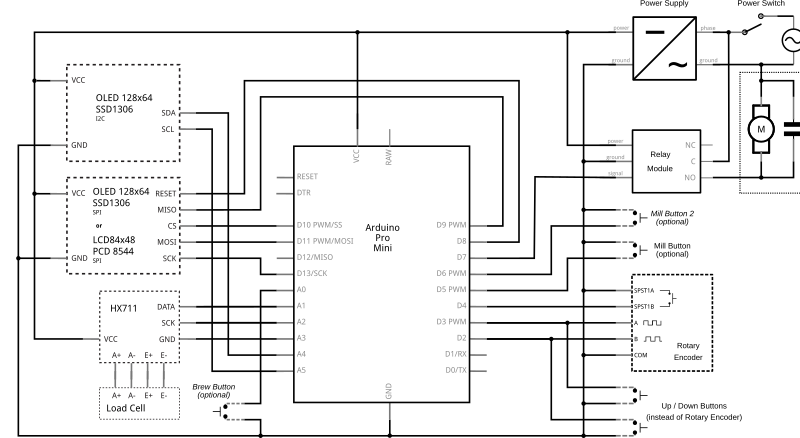
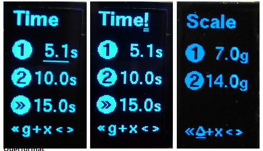
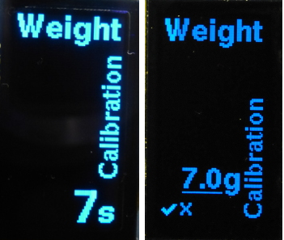
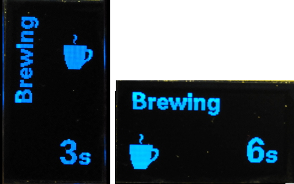

Credits for this are going out to [romanseidl](https://github.com/romanseidl) for starting all of this. If he ever merges my current PRs I would be glade to merge everything into his project. Otherwise this forkes stays alive.

# MillControl - Arduino Coffee Grinder Control (time and weight)

If you speak german you can find a forum with some discussion here: 
https://www.kaffee-netz.de/threads/millcontrol-arduino-muehlensteuerung-mit-timer-gewichtsautomatik-und-brew-timer.95553/

12.12.2021 
- If you wnat to help you can always check the Kaffe-Netz Forum and see if something is missing in the descriptions here. I am still not done with reviewing all the comments.
- You can also have a look at the open issues, e.g. if you found a typo somewhere, if you would like to add a tip, you would like to say thank you ;) or everything else
- Feel free to open new issues, PRs etc.

## Purpose of this project
This was designed to build a time controlled coffee grinder out of any regular machine. 
It was developed to be used with a Graef CM 70 but it should work fine with any brand or models (as you can see below).
During the development process a weight option was introduced as well.

Here are some examples on how it can look at the end:
|   |   |   |   |
|---|---|---|---|
| Source: [Kaffee-Netz comment 116](https://www.kaffee-netz.de/threads/millcontrol-arduino-muehlensteuerung-mit-timer-gewichtsautomatik-waagensteuerung-und-brew-timer.95553/page-6#post-1227378)  | Source: [Kaffee-Netz comment 172](https://www.kaffee-netz.de/threads/millcontrol-arduino-muehlensteuerung-mit-timer-gewichtsautomatik-waagensteuerung-und-brew-timer.95553/page-9#post-1405995)  | Source: [Kaffee-Netz comment 187](https://www.kaffee-netz.de/threads/millcontrol-arduino-muehlensteuerung-mit-timer-gewichtsautomatik-waagensteuerung-und-brew-timer.95553/page-10#post-1684586)  | Source: [Kaffee-Netz comment 199](https://www.kaffee-netz.de/threads/millcontrol-arduino-muehlensteuerung-mit-timer-gewichtsautomatik-waagensteuerung-und-brew-timer.95553/page-10#post-2014633)  |
| Graef CM70 | Graef CM70 | Ascaso | Eureka |
|   |    |   |   |
| Source: [Kaffee-Netz comment 200](https://www.kaffee-netz.de/threads/millcontrol-arduino-muehlensteuerung-mit-timer-gewichtsautomatik-waagensteuerung-und-brew-timer.95553/page-10#post-2015570) | Source: [Kaffee-Netz comment 200](https://www.kaffee-netz.de/threads/millcontrol-arduino-muehlensteuerung-mit-timer-gewichtsautomatik-waagensteuerung-und-brew-timer.95553/page-10#post-2015570)  |   |   |
| Bezzera BB005 | Bezzera BB005 |   |   |

### Hardware Requirements
For beginners [here](forBeginners.md) are some tipps to get started. 
The hardware requirements and some pictures, which show you what the hardware looks like, can be found [here](HardwareRequirements.md).

### Dependencies:
- Encoder (v1.4) - http://www.pjrc.com/teensy/td_libs_Encoder.html
- TimerOne (v1.1) - https://github.com/PaulStoffregen/TimerOne
- U8Glib - https://github.com/olikraus/u8glib

### Electronic schematic

I prefer a old school schmatic style over those fanzy fritzing pictures.

### Deploy the MillController
After you are familiar with the hardware, set up the LED and the OLED display and you have done some other arduino experiments, you are ready for the next step.
And this is, getting the stuff on to the arduino.
To do so, you will have multiple options:

- via arduino [WebEditor](./subPages/arduinoWebEditor.md)
- a local Arduino IDE (integrated development environment)

#### Demo setup
The purpose of the demo setup is to make sure, that all components are working even without installing it on the mill directly. Through that you can test a little and see if all components are working and how the UI works.
This will include:
- a fritzing pictures
- an actual picture from me ;) (I am still not there)

Link to [demoSetup.md](./subPages/demoSetup.md)

#### Contecting it to the mill
work in progress

### User Interface

#### navigation overview
In this section I will insert a navigation overview for all user interaction.

#### Select a Time Mode
You can select from up to 20 time modes with settings for time or weight. 
There are two different time modes: multi selection and single selection (FLAT_MODE in UI.h).

##### multi selection
For every mode there are timeings for a single click, double click (or mill switch 2, if available) and long click.
For a click mode you can set a time / weight or "start/stop" (start mill with click start and stopping it at the next) or hold (longer click, only if more buttons are available).
If there is no mill button then you can only choose from single and double click. Long click is then bound to the edit menu.

###### Portrait mode

###### Landscape Mode

##### single selection
Every time / weight has its own side. With one click this site will be startet. In the direct mode ("start") will start the mill until another click stopps the mill, hold (the hold function also does something. But not clear what.).

###### Portrait mode

###### Landscape Mode

#### Settings
There is an extensive editor allowing you to change the mode (g + w), add a page (+), delete (x) and move (<>). 
Basically there are two modes: time and weights mode

##### time mode
For a time mode the respective times and the title are editable.

###### Portrait mode

###### Landscape Mode

##### weight mode
Alternativly there is a "weight mode automation". A grinde speed will be set in sec/gramms (which is basically also grind duration) and additional some weights. The titel of the page can also be edit.

###### automatic calibration
If you push the mill button inside the editor (or long press on the encoder button, if there is no mill button) the calibration will start.

- In order to start the calibration you should measure the amount of the cup to which you are going to grind the coffee. This will be used to train the scale.
- If the calibration is started the mill runs until the button is released (or if the button is pushed again, e.g. if you have only one button). You should grind at least one normal portion. More would be more accurate.
- After that the automatic will ask for the weight which was ground. Therefore you will need to measure it, select the weight on the menu and confirm with the encoder button.
- After that the grind-speed will be set automatically

###### Portrait mode

###### Landscape Mode

#### Grind!
The grinding will start from the coresponding site with the correct button. If there is a programmed grind time or a weight, there will be a progress bar.
The grinding can be cancled any time by pushing the button which was used to start the grinding. If there is a programmed grindtime, the process will be stoped for 5 secounds and can be resumed with a new button push.
During the grind process the user can change the grind time by turning the turining button. This change will not be saved.

##### Portrait mode

##### Landscape mode

### Brew-Timer
If you set on A0 a button you can get a brew-timer. The timer will be cancled by any interaction and cannot be started during the milling process.

### (c) 2015 by Roman Seidl

This program is free software; you can redistribute it and/or modify
it under the terms of the GNU General Public License as published by
the Free Software Foundation; either version 3 of the License, or
(at your option) any later version.

This program is distributed in the hope that it will be useful,
but WITHOUT ANY WARRANTY; without even the implied warranty of
MERCHANTABILITY or FITNESS FOR A PARTICULAR PURPOSE.  See the
GNU General Public License for more details.

You should have received a copy of the GNU General Public License
along with this program; if not, write to the Free Software Foundation,
Inc., 51 Franklin Street, Fifth Floor, Boston, MA 02110-1301  USA

All trademarks mentioned belong to their owners, third party brands, product names, trade names, corporate names and company names mentioned may be trademarks of their respective owners or registered trademarks of other companies and are used for purposes of explanation and to the owner's benefit, without implying a violation of copyright law. 
